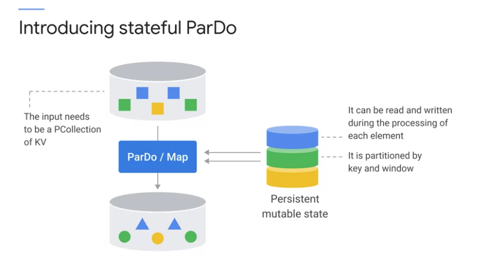
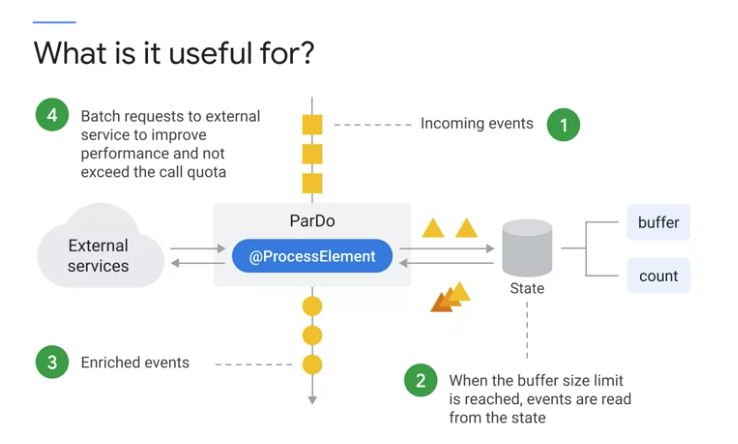
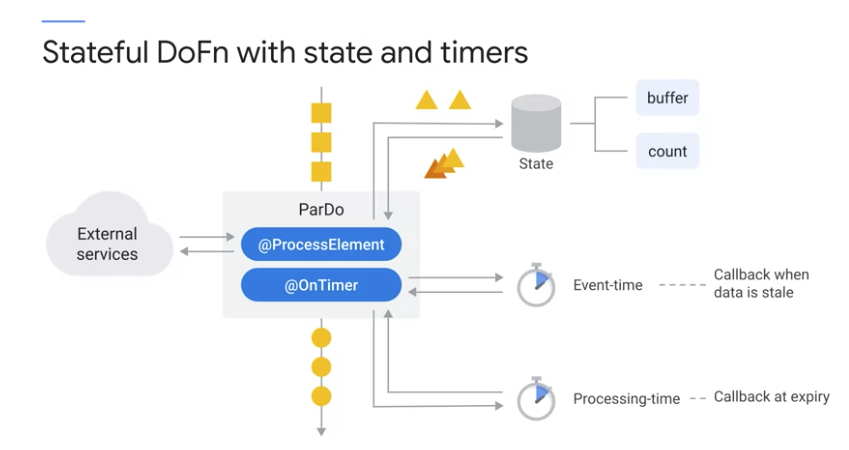
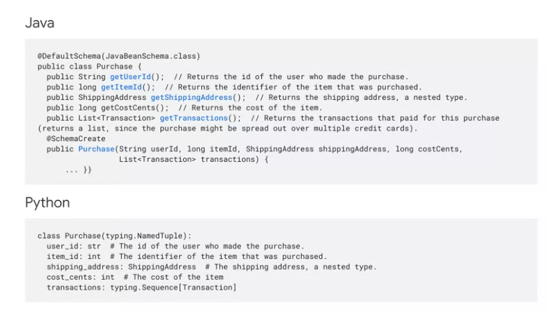
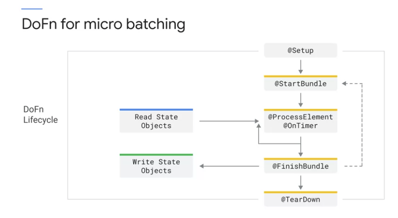

Serverless Data Processing with Dataflow: Develop Pipelines
===========================================================

Summary of the learning

Beam Concepts Review
====================

Beam Basics
-----------

Providing a structure that unifies "Batch" and "Streaming" processing concepts.

Fore main concepts
>>>>>>>>>>>>>>>>>>

* **PTransforms:** holding "input", "transformation(actions)", "output"
* **PCollections:**

  * "the data held on a distributed data structure"
  * Immutable

* **Pipelines:** Identifies "the date to be processed" and "the action to be taken on the data"
* **Pipeline Runners:**

  * analogous to Kubernete Engine.
  * The pipeline can be on local computer, in a VM, in data center, in Cloud (like Data Flow). - main difference is scalability
  *

Batch programming vs. Stream processing
>>>>>>>>>>>>>>>>>>>>>>>>>>>>>>>>>>>>>>>

* Immutable data is one of key difference.
* ( I think the speaker is trying to say that data used to be mutable to increase memory efficienty when it was expensive. )
* ( But, since it is not, to reduce complixity in access control and sharing, Immutable is used in BEAM. )

Utility Transforms
------------------

References: https://beam.apache.org/documentation/transforms/python/overview/

* **ParDo:**
* **ParalleDo:**
* **GroupByKey:** we can put all the elements with the same key together in the same worker.
* **Combine:** if group is very large or data is very skewed. This is betther than "GroupByKey"
* **CoGroupByKey:** Left/Right Outer Join, Inner Join ( different value type )
* **Flatten:** merge more than two PCollections ( for exactly the same type )
* **Partition:** opposite of "Flatten". This divides PCollection to several PCollections by applying a function that assigns a group ID to each element in the input PCollection.

DoFn Lifecycle
--------------

ParDo: kind of simple "map" or "filter" ( with more powerful and versatile transform )

Summary
>>>>>>>

* Elements in a collection are processing bundles.
* The devision of the collection into bundle is arbitrary and selected by Runner.
* Since Runner can select, Streaming Runner can choose small bundle and Batch Processing Runner can choose large bundle.
* Always mutate a state using a state variables rather than class members.

  * Why? Runner may recycle Do Function or process the same bundle in different workers for redundancy.

* a bundle may contain several keys, so store state in maps based on that key.

references
>>>>>>>>>>

* https://beam.apache.org/documentation/basics/
* https://beam.apache.org/documentation/programming-guide/
* https://beam.apache.org/documentation/resources/learning-resources/
* https://beam.apache.org/documentation/patterns/overview/

.. code-block:: python

    # we can override function to control how to interact with each data bundle.
    # Runner may recycle Do Function or process the same bundle in different workers for redundancy.
    # so, do not mutate external state from your process method.
    # Ensure any state variable is clear in the start bundle method
    # otherwise, the state variable might have one from prev. bundle.
    # FYI, bundle may contain several keys, so store state in maps based on that key.
    class MyDoFn(beam.DoFn):
        def setup(self):
            # google palce to setup db connection / helper process
            pass
        def start_bundle(self):
            # good place to start tracking bundle
            # instance variables or metrics
            pass
        def process(self, element):
            # this is main function
            # this is where tranform happens.
            # this may read the state objects or recive side inputs
            # we can update the state
            pass
        def finish_bundle(self):
            pass
        def teardown(self):
            # this is where we close db connections we open setup method.
            pass

Qwikilabs practice
------------------

* https://googlecoursera.qwiklabs.com/focuses/16599218?parent=lti_session
* https://github.com/GoogleCloudPlatform/training-data-analyst/blob/master/quests/dataflow_python/1_Basic_ETL/solution/my_pipeline.py
* https://github.com/GoogleCloudPlatform/DataflowTemplates/blob/master/src/main/java/com/google/cloud/teleport/templates/TextIOToBigQuery.java
* https://cloud.google.com/dataflow/docs/guides/templates/provided-templates

Windows, Watermarks, Triggers
=============================

Data processing in a streaming with Dataflow.
These are three concepts to know.

* How to group data in Windows
* The importance of Watermarks
* When / How many times the Windows will emit output.

Streaming is not only about continuous.
It is also about the lack of order in data processing.

* Windows: Helping recover the natural order of the data.
* Watermarks: Helping determine either complete or still waiting for more data.
* Trigger: Helping handle late data. ( a window can have several triggers )

Windows in Beam
---------------

You decide where you put the message.

* as a way to divide data in groups to transform the data.
* dividing data into time-base finite chunks.
* Required when doing aggregatios over unbounded data using Beam primitives ( GroupByKey, Combiners )

    * It's possible to aggregate based on state and timers

* Two dimensions of times

    * Processing time
    * Event Time

* deciding where(window) to put the msg ( by `processing time` or `event time` )

Windowing by Processing time
>>>>>>>>>>>>>>>>>>>>>>>>>>>>

.. image:: ./images/gcp-dataflow-course2-wk1-5.png

* Using `current timestamp` assigned to every new message by Dataflow.
* This is the same as micro batching.

    * the msg will be assigned to different batches if msg arrives out of order.

Windowing by Event Time
>>>>>>>>>>>>>>>>>>>>>>>

.. image:: ./images/gcp-dataflow-course2-wk1-6.png

Using timestamp in the orginal message that is generated by "Source"

Types of windows in Apche Beam
>>>>>>>>>>>>>>>>>>>>>>>>>>>>>>

* **Fixed:** none-overlapping interval
* **Sliding:** may overlap interval, calculating a moving average
* **Session:** capturing burst user activities.

    * timing is triggered by another element.
    * data dependent

* **Custom:**

Watermarks
----------

You decide when "Windows" emit the results.

* Decide when the window emits the results
* simply maybe when the window closes. ( intuitive for fixed window )

    * not so obvious for Session window
    * there could be late data
    * how to define late data?

.. image:: ./images/gcp-dataflow-course2-wk1-9.png

* The relationship between `processing timestamp` and `event timestamp` defines the watermark.
* Any msg before the watermak is considered to be `early`
* Watermark defines if the msg is late or not.
* Watermark can't be calculated because it is for msg that have not been seen.

  * Dataflow estimates it with the oldest timestamp waiting to be processed.
  * The watermark estimation is continuously updated with every new received msg.

.. image:: ./images/gcp-dataflow-course2-wk1-10.png

* **Lag time:** the difference between expected and actual arriving time.
* the deviation from the ideal expectation(lag time) is `watermark`.

.. image:: ./images/gcp-dataflow-course2-wk1-11.png

* I have to make a decision what I would do with the late data.
* The default behavior is to drop the late data.

.. image:: ./images/gcp-dataflow-course2-wk1-12.png

* Data freshness: a measurement of how far the oldest messages is far from the current moment.

  * The below graph shows monitonically increasing value. I might be cause pipline with  processing message
  or input message is increased very quickly and data is accumlating,, or both.
  * how to differciate them?

* System Latency: measuring the time it takes to fully process a message. ( inculding wait time. )

Triggers
--------

Triggers are useful to define in precise detail when we want to see the results of our window.

* **Event time:** They operate on event time.
* **Processing time:** They operate on processing time.
* **Composite:** They combine multiple triggers.
* **Data-driven:** examining the data as it arrives and firing when it meets a certain condition.

Accumulation Modes
>>>>>>>>>>>>>>>>>>

* Accumulate

    *  using all msg in the window
    *  cons: if window is wide, resource usage is high.

* Discard

    * using only the msg arrived since the prev. calculation ( only using new msg )
    * pros: although window is wide, resource usage is low.

Qwikilabs practice - Batch Analytics
------------------------------------

* https://googlecoursera.qwiklabs.com/focuses/17762887?parent=lti_session

.. code-block::

    git clone https://github.com/GoogleCloudPlatform/training-data-analyst
    cd ~/training-data-analyst/quests/dataflow_python/

Part 1: Aggregating site traffic by user
>>>>>>>>>>>>>>>>>>>>>>>>>>>>>>>>>>>>>>>>

Solution: https://github.com/GoogleCloudPlatform/training-data-analyst/blob/master/quests/dataflow_python/3_Batch_Analytics/solution/batch_user_traffic_pipeline.py

1. Reads the day’s traffic from a file in Cloud Storage
2. Converts each event into a CommonLog object.
3. Sums the number of hits for each unique user by grouping each object by user ID and combining the values to get the total number of hits for that particular user.
4. Performs additional aggregations on each user
5. Writes the resulting data to BigQuery

Part 2: Aggregating site traffic by minute
>>>>>>>>>>>>>>>>>>>>>>>>>>>>>>>>>>>>>>>>>>

Qwikilabs practice - Streaming Analytics Pipeline
--------------------------------------------------

* https://googlecoursera.qwiklabs.com/focuses/17762887?parent=lti_session

.. code-block::

    git clone https://github.com/GoogleCloudPlatform/training-data-analyst
    cd ~/training-data-analyst/quests/dataflow_python/

Objectives
>>>>>>>>>>

* Read data from a streaming source.
* Write data to a streaming sink.
* Window data in a streaming context.
* Experimentally verify the effects of lag.

Quizs
-----

1. What can you do if two messages arrive at your pipeline out of order?

    A. You can recover the order of the messages with a window using event time.

2. What are the types of windows that you can use with Beam?

    A. Fixed, sliding, and session windows

3. How does Apache Beam decide that a message is late?

    A. A message is late if its timestamp is before the watermark. ( I think this answer is incorrect. )

4. How many triggers can a window have?

    A. As many as we set.

Additional resources
--------------------

* https://www.youtube.com/watch?v=TWxSLmkWPm4
* https://www.oreilly.com/radar/the-world-beyond-batch-streaming-101/
* https://www.oreilly.com/radar/the-world-beyond-batch-streaming-102/
* https://beam.apache.org/documentation/programming-guide/

Sources & Sinks
---------------

Sources & Sinks
>>>>>>>>>>>>>>>

    * a `souce` is when you read input data into a BEAM pipeline.
    * a `sink` is PTransform that performs a writer to the specified detination.
    * a common output for a `sink` is PDone

.. image:: ./images/gcp-dataflow-course2-wk1-18.png

* Text IO & File IO
* BigQuery IO
* PubSub IO
* Kafka IO
* BigTable IO
* Avro IO
* Splittable DoFn

Beam schemas
============

* All PCollection must consist of elements of the same type.
* By understanding the structure of a pipeline's records, we can provide much more concise APOs for data processing.

What is a schema?
-----------------

* A schema describes a type in terms of fields and values.
* Fields can have string names or be numerical indexed.
* There is a known list of primitive types a field can have like int, long, and string.
* some fileds can be marked as optional
* Schemas can be nested arbitrarily, and can contain repeated or map fields as well.

References about Schema
-----------------------

* https://beam.apache.org/documentation/programming-guide/#schemas
* https://github.com/GoogleCloudPlatform/dataflow-sample-applications/tree/master/retail/retail-java-applications

State and Timer
===============

State API: aggregations
-----------------------

* two main transforms: GroupByKey or CombinePerkey
* ParDo ( Map ) can't do aggregation. Why?

State API: Stateful ParDo
-------------------------

* Example use case: by keeping things into Buffer, we can reduce external call ( call to resource by grouping them. )

.. image:: ./images/gcp-dataflow-course2-wk2-3.png

Timer API
---------

* Processing-time timers: Callback after a certain amount of time has elapsed.

  * timeouts
  * Relative times("in 5 min")
  * Periodic output based on state

* """Event-time:""" callback when the watermark reaches some threshold.

     * Output based on completeness of input data
     * Absolute tiems ("when the data is complete up to 5:00am")
     * Final/authoritative outputs
     * Don't leave data behind in state!

Types of state variables
------------------------

* Value: Read/write any value (but always the whole value)
* Bag: Cheap append No ordering on read
* Combining: Associative/commutative compaction
* Map: Read/write just keys you specify
* Set: Membershihp checking ( Dataflow runner is not supported. )

Stateful ParDo with state and timers
-------------------------------------

Beam Best Pratices
==================

Schemas
-------

Handling unprocessable data / Error Handling
---------------------------------------------

* Errors and exceptions are part of any data processing pipeline.
* Within the DoFn, always use a try-catch block around actiities like parsing data.
* In the exception block, send the erroneous records to a separate sink, instead of just logging the issue.
* Use tuple tags to access multiple outputs from the PCollection.

Utilize DoFn lifecycle
----------------------

Pipeline Optimizations
----------------------

Filter data early
>>>>>>>>>>>>>>>>>

1. Filter data early in pipeline whenever possible
2. Mve any steps that reduce data volume up in your pipeline

Apply data transformations serially
>>>>>>>>>>>>>>>>>>>>>>>>>>>>>>>>>>>

1. Apply data transformations serially to let Dataflow optimize DAG
2. Transforms applied serially are good candidates for graph optimization because multiple steps can be fused in a single stage for execution in the same worker node.

Handle back pressure from external systems
>>>>>>>>>>>>>>>>>>>>>>>>>>>>>>>>>>>>>>>>>>

1. While working with external systems, look out for back pressure.
2. Ensure external system are configured to handle peak volume
3. Enable autoscaling to downscale if workers are underutilized.
